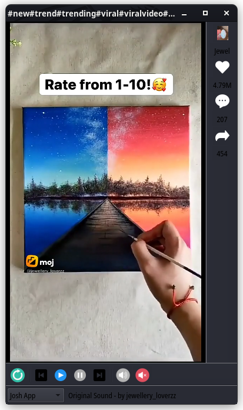
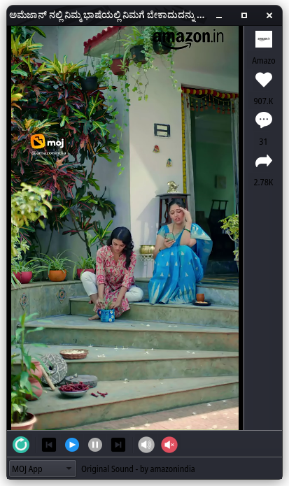

# Short videos app - India

Another short videos app for Hindi audience. Made with 3 different apis:

* Moj app
* Josh app
* Chingari app

## Authetication

No authetication required as of now.

## Run
Binary file can directly be run from [here](./bin/shorts-app).

## Compilation
Can be compiled with `qmake` from the source given [here](./src).

## Requirements

* qmake
* gcc

## Preview

## Future development

Many feature are planned and being add and will be updated with bug fixes.

## Feedback

Please consider submitting Issues or Pull Requests, we would love to look on it.

Also you can submit bugs and feedbacks directly to our [email](mailto:://0x0is1@protonmail.com)

## Contribution

Always credit will be given on readme on contribution.

Contributors till now:

* [Surya](github.com/0x0is1)
